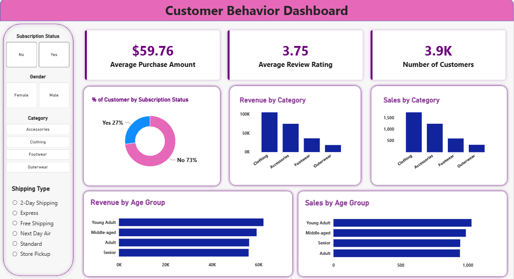

# Customer Shopping Behavior Analysis

End-to-end analysis of retail customer data: **Python** for cleaning, **PostgreSQL** for analysis, **Power BI** for the dashboard.



## Business Problem
A retail company wants to understand how discounts, reviews, seasons and payment preferences affect purchases and repeat buying, so it can improve sales, customer satisfaction and loyalty.

**Goal:** use shopping data to identify trends, improve customer engagement, and optimize marketing and product strategy.

## Dataset
- 3,900 customers, 18 columns
- Covers demographics, product, category, purchase amount, season, review rating, subscription, shipping type, discount use, previous purchases, payment method and purchase frequency

## Tools
| Stage | Tool |
|---|---|
| Data cleaning | Python (pandas, SQLAlchemy) |
| Analysis | PostgreSQL |
| Visualization | Power BI |

## Workflow
`Raw CSV` → `Python cleaning` → `PostgreSQL` → `SQL queries` → `Power BI dashboard`

## 1. Data Cleaning (Python)
- Filled 37 missing review ratings with the median rating of each product category
- Renamed columns to snake_case
- Created `age_group` (4 quartile-based groups) and `purchase_frequency_days`
- Dropped `promo_code_used`, which was identical to `discount_applied`
- Loaded the cleaned data into PostgreSQL

## 2. SQL Analysis
10 business questions answered using aggregations, subqueries, CASE, CTEs and window functions (`ROW_NUMBER`), including:
- Revenue by gender and by age group
- Discount users who still spent above average
- Top products by rating and by discount rate
- Top 3 products per category
- Customer segments (New / Returning / Loyal)
- Subscribers vs non-subscribers
- Standard vs Express shipping

Full queries: [`Customer_Shopping_Behavior_Analysis.sql`](Customer_Shopping_Behavior_Analysis.sql)

## 3. Power BI Dashboard
Interactive, single-page dashboard built on the cleaned data.
- **KPI cards:** Average Purchase Amount ($59.76), Average Review Rating (3.75), Number of Customers (3.9K)
- **Charts:** subscription split (27% subscribed vs 73% not), revenue and sales by category, revenue and sales by age group
- **Slicers:** Subscription Status, Gender, Category, Shipping Type

File: `customer_behavior_dashboard.pbix`

## Key Insights
- **Male customers generate about 68% of revenue** ($157.9K of $233K), mainly because they are about 68% of the customer base. Average spend per order is almost the same for both genders (~$60).
- **Only 27% of customers are subscribed, and they do not spend more per order** ($59.49 vs $59.87), so subscription is not yet driving higher spend.
- **Loyal customers dominate**: 80% of customers have more than 10 previous purchases, while only about 2% are new. Acquiring new customers is a clear opportunity.
- **Young Adults are the top-spending age group** ($62K), followed by Middle-aged ($59K).
- **Clothing is the top category** with 45% of revenue ($104K), followed by Accessories (32%).
- **43% of purchases use a discount**, and the most discounted items (Hat, Sneakers, Coat) are used in about 50% of their orders.
- **Revenue is evenly spread across seasons** (Fall is slightly highest), so promotions can be planned year-round.

## Recommendations
- Make subscriptions more valuable (exclusive offers, free shipping) to lift spend and retention
- Run acquisition campaigns, since the new-customer base is very small
- Target female customers, an under-penetrated segment with similar spend per order
- Reduce blanket discounts on items already selling well and test their impact on margin

## Folder Structure
```
├── data/            customer_shopping_behavior.csv
├── notebooks/       Customer_Shopping_Behavior_Analysis.ipynb
├── sql/             Customer_Shopping_Behavior_Analysis.sql
├── powerbi/         customer_behavior_dashboard.pbix
├── images/          dashboard_preview.png
└── README.md
```

## How to Run
1. Run the notebook to clean the data and load it into PostgreSQL (update your own DB credentials)
2. Run the SQL queries in pgAdmin or any SQL client
3. Open the `.pbix` file in Power BI Desktop

## Author
**Mahesh Kumar** | [LinkedIn](https://www.linkedin.com/in/mahesh-ba5a9b35a) | mahesh9559ya@gmail.com
